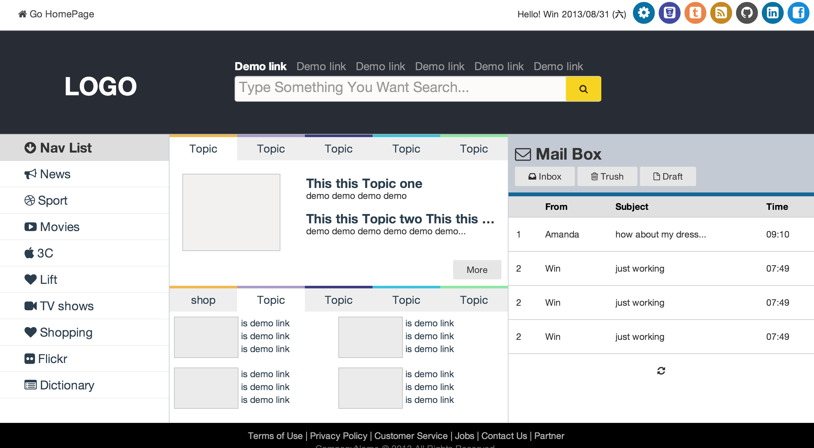
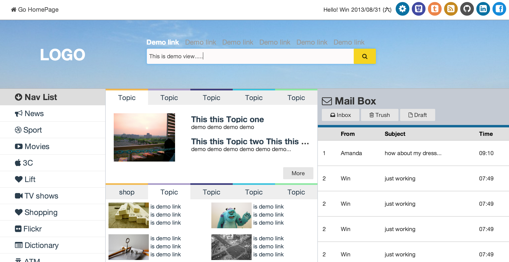

#Pure CSS Layout Practice Work
* If you like it, and want to use this layout, please git pull branch:gh-pages instead master
* use PureCSS (http://purecss.io) to make this layout
* What is Pure CSS, can refer the website : [http://purecss.io/](http://purecss.io/)
* this practice with Font-Awesome [http://fortawesome.github.io/Font-Awesome](http://fortawesome.github.io/Font-Awesome)

##Intro
###(1) 
* Demo screenshot：（homepage/index.html）:

* Demo screenshot：

###Test in Browser
* `Firefix`, `Chrome` is OK.
* still not completed....

###Author
* Author : Win Wu
* Blog : <http://yiyingloveart.blogspot.tw/>
* Update Date : 2013-08-31
* License : 
